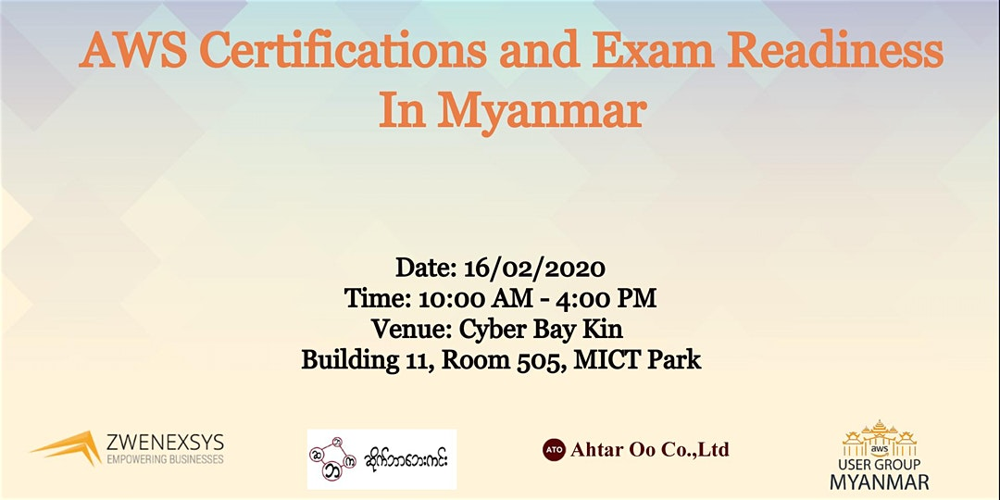

# AWS User Group Myanmar Upcoming Events

## AWS Certifications and Exam Readiness In Myanmar

### 15/02/2020 - 10AM ~ 5PM

### About this Event

Event Organizer - AWS User Group Myanmar  
Co-Event Organizer - Zwenexsys International Ltd.  
Venue Sponsor - Cyberbaykin  
Lunch Sponsor - Ahtar Oo Co., Ltd.

This event will be intended to person who will sit the AWS exam shortly and want to learn "what is the facts to know before AWS exam".  
  
AWS User Group Myanmar welcomes you to join and explore AWS Certification preparation and readiness guide to enter the AWS Exam with full confidence.

### Registration 

> [https://bit.ly/38oeCRC](https://bit.ly/38oeCRC)

