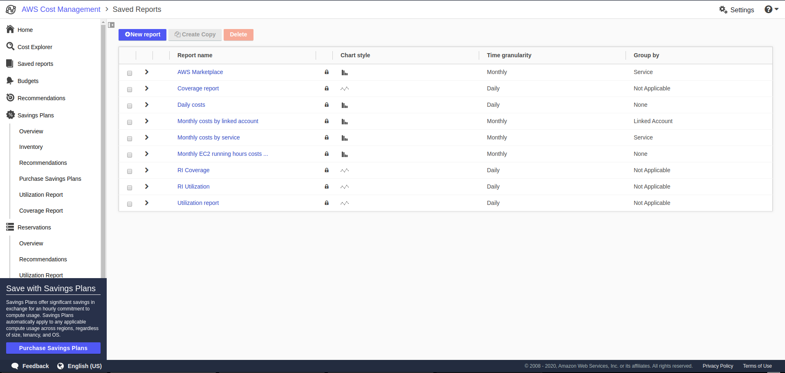
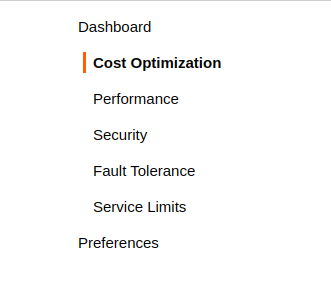
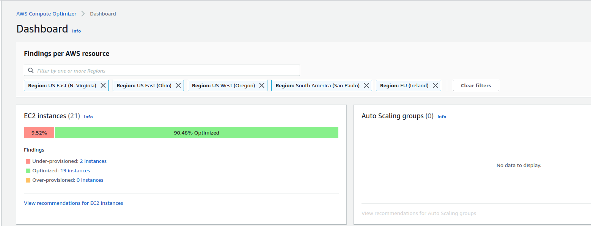
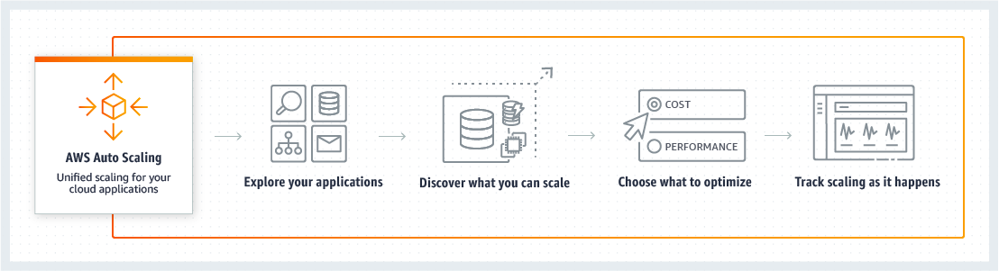

# Cost Optimization on AWS Cloud - Part 2

## ကျွန်တော်တို့ အရင် [**article**](https://blog.awsugmm.org/cost_and_billing/cost_optimization) မှာတော့ Cost Optimize လုပ်ဖို့လိုအပ်တဲ့ အရာလေးတွေနဲ့ Billing သဘောတရားများကို အကြမ်းဖျင်းအနေနဲ့ ပြောပြီးပြီဆိုတော့ ဒီ Part 2 မှာနောက်ထပ် အကြောင်းအရာလေးတွေ ကိုထပ်ပြီးဆွေးနွေးကြရအောင်ဗျာ။ 


Cost Optimization နဲ့ ပတ်သက်တဲ့ ဆက်စပ်နေတဲ့ နောက်ထပ်အကြောင်း အရာတစ်ခုက တော့ Right Sizing   ပါ။ Right Sizing ပြုလုပ်တာက ကိုယ့် ရဲ့ infrastructure cost ကို သိသိသာသာသက်သာစေပါတယ်။ 


AWS မှာ Right Sizing လုပ်မယ်ဆိုရင်တော့ ကျွန်တော်တို့ အနေနဲ့ ရှေ့ article မှာပြောခဲ့သလိုတွေပြုလုပ်နိုင်ပါတယ်။ နောက်ပြီးတော့ ကျွန်တော်တို့ အနေနဲ့ AWS က သူ Ecosystem မှာ Right Sizing ပြုလုပ်နိုင်ဖို့ ထုတ်ပေးထားတဲ့ Tools တွေကို သုံးပြီးလည်းပြုလုပ်နိုင်ပါတယ်။ 

* ပထမဆုံးတစ်ခုက **AWS Cost Explorer** ပါ။ ဒီကောင်လေးကတော့ ကိုယ်သုံးနေတဲ့ ဘယ် resource တွေက ဘယ်လောက်တော့ ကုန်ကျနေတယ်ဆိုတာကိုပြန်ကြည့်လို့ရပါတယ်။ နောက်ပြီး လွန်ခဲ့တဲ့ ၇ရက် ၁လ ၂လ ကကိုယ်သုံးခဲ့တဲ့ resource တွေရဲ့ utilization ကိုအခြေခံပြီး ဘယ် resource တွေကတော့ reserved လုပ်သင့်တယ် တစ်ချို့ဆိုလည်း Down Sizing လုပ်သင့်တယ် ဘာညာစတာတွေကို ပြပေးထားတဲ့ အတွက် ကျွန်တော့်တို့ က သူ့ tools က ထုတ်ပးတဲ့ Data တွေနဲ့ ကိုယ့် environment , organization ကလိုချင်တဲ့ လိုအပ်တဲ့အရာတွေနဲ့ ကိုက်ညီတယ်ဆိုရင် ကျွန်တော်တို့က လွယ်လွယ်ကူကူပဲ Cost Optimize ပြုလုပ်နိုင်မှာပါ။ 

* နောက်ထပ်တစ်ခုကတော့ AWS Trusted Advisor ပါ။ **သူကတော့ ကိုယ့် AWS account ရဲ့ Support Plan ပေါ်မူတည်ပြီး သုံးလို့ရတဲ့ Features တွေတော့ ကွာခြားချက်ရှိပါတယ်။** ကိုယ်တော်တို့ ကတော့ Business Plan ယူထားတဲ့ အတွက် Feature အစုံသုံးလို့ရနေပါတယ်။ Trusted Advisor ထဲက Cost Optimization Checks ဆိုတဲ့ feature ရဲ့ အကူအညီနဲ့လည်း Low utilization EC2 Instance တွေ Idle ဖြစ်နေတဲ့ RDS Instance တွေ မသုံးပဲ ထားမိနေတဲ့ Resources တွေကို ပြပေးပါတယ်။ အဲ့သည်လိုပြပေးတဲ့ အတွက်ကျွန်တော်တို့က ဘယ် resource တွေကကိုယ်တစ်ကယ်မသုံးပဲ ပိုက်ဆံကုန်နေသလဲ ဆိုတာကို မြန်မြန်ဆန်ဆန်သိနိုင်တာပေါ့ဗျာ။ 

* နောက်ထပ်တစ်ခုကတော့ AWS Compute Optimizer ဆိုတဲ့ Tools လေးပါ။ သူကတော့ AWS ရဲ့ Service တစ်ခုအနေနဲ့ဖြစ်လာတာတော့ မကြာသေးပါဘူး။ ဒါပေ့မယ် တော်တော်လေးအသုံးဝင်တဲ့ Tool တစ်ခုပါ။ Compute Optimizer ဆိုတဲ့ အတိုင်းပဲ EC2 Instance တွေ Optimize ဖြစ်ရဲ့လား Over Provision/Under Provision ဖြစ်နေလားဆိုတာကိုကြည့်လို့ရမယ်၊ မြန်မြန်ကြည့် မြန်မြန်သိတော့ Cost Optimize မြန်မြန်လုပ်နိုင်တာပေါ့ဗျာ။  လက်ရှိမှာတော့ Compute Resource တွေထဲကမှာ AWS EC2 Instance နဲ့ Autoscaling Group တွေအတွက်ပဲ အသုံးပြုလို့ရနိုင်ပါသေးတယ်။ နောက်ထပ်တစ်ခုက အခုအချိန်မှာတော့ AWS Region ၅ ခုမှာပဲ အသုံးပြုနိုင်ပါသေးတယ်။ 

ကျွန်တော့်ကိုယ်ပိုင် အမြင်နဲ့ပြောရရင်တော့ ဒီ tools လေးတွေကတော်တော် အထောက်အကူပြုပါတယ်။ ကျွန်တော်တို့အနေနဲ့ Instance တစ်လုံး နှစ်လုံးဆိုရင်တော့ tools တွေ အကူအညီမယူပဲ ကိုယ့်ဘာသာကိုယ်တွက်လို့ရနိုင်ပါတယ်။ Server အလုံး တစ်ဆယ် နှစ်ဆယ် တစ်ရာ နှစ်ရာဖြစ်လာပြီဆိုရင်တော့ ဒီ tools တွေရဲ့ အကူအညီနဲ့ Monitoring Metric ကရတဲ့ဒေတာတွေနဲ့ ပေါင်းပြီး မှန်မှန်ကန်ကန်နဲ့ မြန်မြန်ဆန်ဆန် Cost Optimized ပြုလုပ်နိုင်မှာဖြစ်ပါတယ်။ 

## Reserved Instance

နောက်ထပ် Cost Optimize လုပ်နိုင်မဲ့ အချက်ကတော့ မိမိ Infrastructure က Steady Workload လိုမျိုးရှိနေပြီဆိုရင် ကိုယ်ရဲ့ Business နဲ့လည်းကိုက်ညီမယ်ဆိုရင် Reserved လုပ်ခြင်းကို ရွေးချယ် ။ ဥပမာ ကျွန်တော်တို့ Gym မှာပိုက်ဆံပေးပြီးသွားဆော့သလိုပဲ တစ်နေ.ဆော့ရင် \( On-Demand \) ဆိုရင် စျေးတစ်မျိုး ၁နှစ်စာကြိုပေးပြီးဆော့မယ်ဆိုရင်စျေးတစ်မျိုး \(  AllUpFront \) ၁ နှစ်တော့ဆော့မယ် တစ်လချင်တစ်မျိုး \( NoUpfront \) ၁နှစ်တော့ ဆော့မယ် ၆လတစ်ဖြတ်ပေးမယ် \( PartialUpFront \) ဆိုတဲ့ သဘောတရားပါပဲ။ ဆိုလိုတာက ကိုယ့်ရဲ့ Infra အနေအထား မြွေဖားက ပြောင်းဖို့မရှိဘူး ဒါမှမဟုတ် တစ်နှစ်အတွင်းဒီ ဟာကို အပြီပြင်သုံးမယ်ဆို Reserved Instance က On-Demand ထက်ပို စျေးသက်သာပါတယ်။ ဆိုတော့ Compute EC2 Reserved Instance သုံးတော့မယ်ဆို သိသင့်တာလေးတစ်ခုက သူရဲ့ အမျိုးအစားလေးပါပဲ ဘာတွေလဲဆိုတော့ 

1. **Standard** 
2. **Convertible** 

တွေပဲဖြစ်ပါတယ်။ အဲ့ထဲမှာ Standard က  Convertible ထက်ပိုပြီးစျေးကိုသက်သာစေပါတယ်။ အဲ့နှစ်မျိုးဘာတွေကွာလဲ ဆို တော့ Standard က သာမန် တစ်နှစ် သုံးနှစ် Reserved လုပ်လိုက်ပြီဆိုရင် သူက Region or AZ ပြောင်းလိုတော့ရပါတယ် နောက်ပြီး Instance Flexible ရတယ်ဆို တော့ Same Instance Family က Size အတိုးလျော့လုပ်လို.ရပါတယ် ဒါပေမဲ့ Instance Family တော့ပြောင်းမရပါဘူး ဆိုလိုတာ က T-series standard reserved ကို တစ်နှစ်ဝယ်ထားရင်  M-series ကို ပြောင်းမရပါဘူး။ ဒါလေးက Standard Reserved ရဲ့ Limitation လေးပေါ့။ Convertible ဆိုရင်တော့ Standard ထက်နည်းနည်းလေးပိုစျေးပေးရမယ် ဒါပေမဲ့ သူက convertible ဆိုတဲ့အတိုင်း Instance Size or Family လေးတွေပြောင်းလို.ရတယ်။ အကျယ်တဝန့် ကိုလည်း သူရဲ့ Official Documentation မှာဝင်ရောက်ဖတ်လို.ရပါတယ်။ ဒါဆို reserved instance ကို ယေဘူယျ တော့ သဘောပေါက်လောက်ပြီထင်ပါတယ်။ ခြုံပြောရရင်တော့ ကျွန်တော်တို့ က အချိန်ဘယ်လောက်အတိုင်းအတာသုံးပါမယ်ဆိုပြီး commit လုပ်ထားမယ် အချိန်များများ commit လုပ်ရင် Discount \( 31%~75% \) လောက်ထိ များများသက်သာမယ်ပေါ့ဗျာ။ 


[https://docs.aws.amazon.com/AWSEC2/latest/UserGuide/reserved-instances-types.html](https://docs.aws.amazon.com/AWSEC2/latest/UserGuide/reserved-instances-types.html)



[https://aws.amazon.com/blogs/aws/new-instance-size-flexibility-for-ec2-reserved-instances/](https://aws.amazon.com/blogs/aws/new-instance-size-flexibility-for-ec2-reserved-instances/)



Reserved ဝယ်တဲ့ အခါမှာ ကိုယ်တစ်ကယ်သုံးချင်တဲ့ Region နဲ့ တစ်ကယ်သုံးခင်တဲ့ လိုအပ်တဲ့ အရေအတွက် ကိုပဲဝယ်ယူသင့်ပါတယ်။ ပိုဝယ်မိလိုက်တာတို့ ဘာတို့ဆိုရင် ဒီကုန်ကျစရိတ်ကို ကိုယ်ကမသုံးလည်းပဲ ပေးချေနေရတော့မှာပါ။ 


## Elasticity 

Cost Optimize ပြုလုပ်နိုင်မဲ့ နောက်တစ်ချက်အနေနဲ့ကတော့ Elasticity ပဲဖြစ်ပါတယ်။

Elasticity အနေနဲ့ဆိုရင် အဓိက ၂ ပိုင်းခွဲလို့ရတယ်ပေါ့နော် 

1. **Time-Based**
2. **Volume-Based** 

#### **Time-Based** 

မှာသိသိသာသာ Cost လျော့နိုင်တာကတော့ ကျွန်တော်တို့ရဲ့ **Development/QA/Staging Environment က Server တွေကို ကိုယ့်ရုံးချိန်အလိုက် အပိတ်အဖွင့်ပြုလုပ်တာမျိုးပေါ့။** AWS EC2 Instance တွေက EBS ကလွဲရင် ပိတ်ထားရင် ပိုက်ဆံမကောက်ပါဘူး။ အဲ့သည်အတွက် ရုံးချိန်ပြင်ပနဲ့ စနေ တနင်္ဂနွေလိုနေ့မျိုးတွေမှာ ကိုယ်ရဲ့ Development/QA/Staging environment က Instance တွေကို EC2 Instance Scheduler နဲ့ Auto **START/STOP** လုပ်ထားမယ်ဆိုရင်ရုံးချိန်အတွင်းသုံးတဲ့ ၈ နာရီစာလောက်ပဲကုန်ကျမှာဖြစ်ပါတယ်။ 


Please don't ever try on your production environment. If yes, do as your own RISK !!


#### Volume-Based

 ဥပမာ ကျွန်တော်တို့ရဲ့ Web Server က LoadBalancer အနောက်မှာ အမြဲတမ်း ၂ လုံး Up and Running ဖြစ်နေရမယ်ဆိုပါစို့။ အဲ့သည်မှာ ကျွန်တော်တို့ Company က Promotion ချလို့ User Base ကအရမ်းများလာပြီဆိုရင် အနောက်က web server ၂ လုံးက Load မခံနိုင်တော့ဘူးဆိုရင် ကျွန်တော်တို့ ကလုပ်စရာ ၃ မျိုးလောက်ဖြစ်လာပြီ။ အဖြေရှာရင် ကျွန်တော်တို့က User တွေအသုံးမများခင်မှာ ကြိုတင်ပြီးတော့ server ကို instance size ကြီးကြီးသုံးထားမလား ၊ အဲ့လိုသုံးလိုက်ပြန်ရင်လည်း User တွေမသုံးခင် ကြိုပြင်ထားရဆိုတော့ Cost effective လည်းမဖြစ်လှဘူး မသုံးပဲကြိုပေးနေရမှာ၊ နောက်တစ်ခုက User တွေများလာတော့မှ Server ကို Vertically Scaling - CPU, Memory တွေထပ်တိုတာမျိုး လုပ်မလား၊ သည်လိုဆိုရင်လည်း အဆင်မပြေသေးပြန်ဘူး။ အဲ့သည်မှာ Elasticity ဆိုတာလိုလာတယ်။ ဒီနေရာမှာ Customer Demand ဘယ်လောက်များများ ကျွန်တော်တို့ Infrastructure က အလိုလလျောက် ကြုံ့နိုင်ဆံ့နိုင်မယ်ဆိုရင် Business လည်းမထိခိုက်ဘူး Customer တွေရဲ့ စိတ်ကြေနပ်မှုကိုလည်း တိုးမလာရင်တော့ မကျသွားတော့ဘူးဗျာ။ နောက်တစ်ခုက အဓိက အချက်ဖြစ်တဲ့ Cost Effective လည်းဖြစ်မယ်ဆိုရင် Win-win ပဲ။ သည်တော့ ကျွန်တော်တို့ AWS Autoscaling လိုဟာမျိုးကိုသုံးပြီး Customer Demand နဲ့ကိုက်ညီအောင် Auto Scale Out / In လုပ်လို့ရနိုင်မယ်။ ဆိုလိုတာကတော့ အသုံးပြုတဲ့ User တွေများလာလို့ CPU Utilization , Network Utilization , Memory Utilization ဘယ်လောက်ရောက်ရင်တော့ အစက Server ၂ လုံးရှိတာကနေ နောက်ထပ် ၃ လုံးလား ၅လုံးလာ Auto Scale Out လုပ်လို့ရနိုင်မယ်။ အိုကေ အဲ့မှာ User တွေသိပ်မသုံးတော့ဘူး ဆိုလည်း Server ရဲ့ resource utilization လည်းပြန်ကျသွားရင် ကျွန်တော်တို့က Auto Scale In ဖြစ်အောင်လုပ်ထားမယ် Elasticity ရှိမယ်ဆိုရင် အပေါ်မှာပြောခဲ့သလိုပဲ Win-win solution ဖြစ်မယ်ပေါ့‌ဗျာ :\) 

