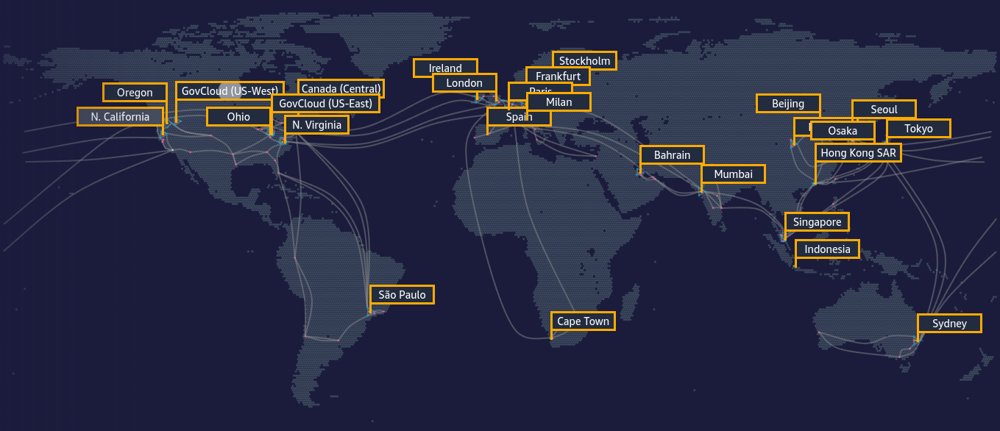
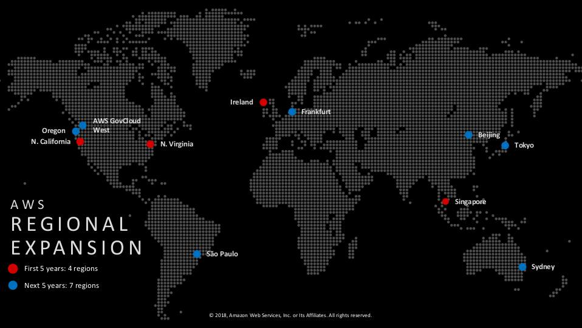
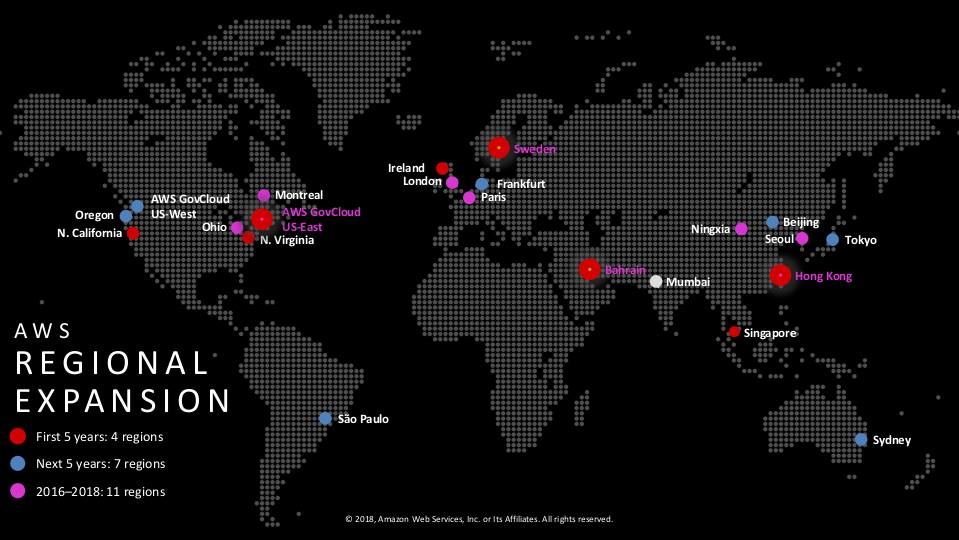
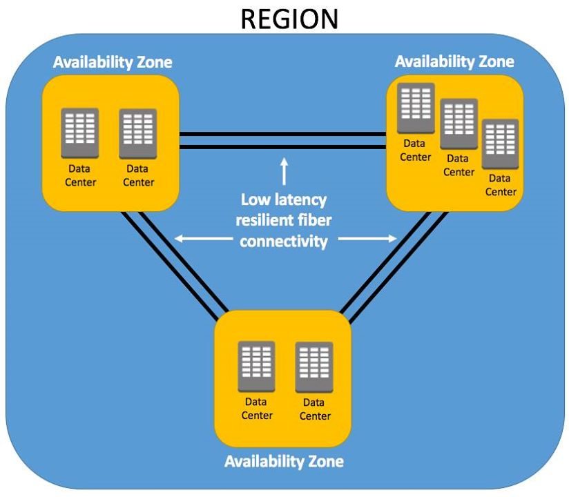
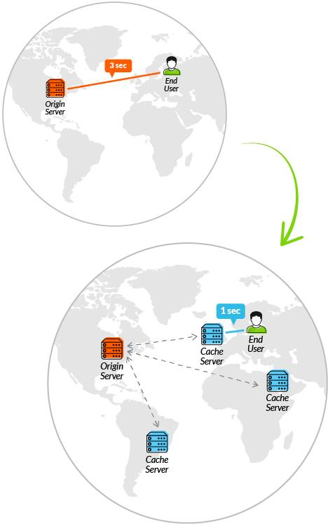
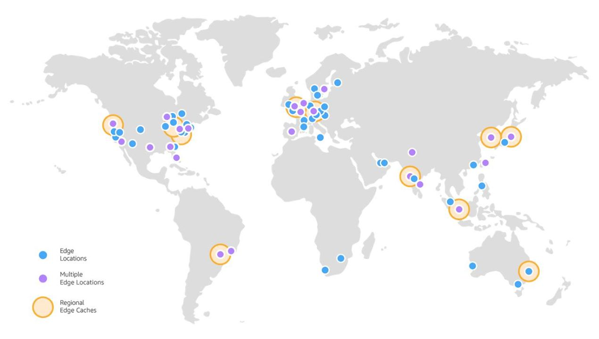

# AWS Global Infrastructure

ဒီနေ့မှာတော့ Cloud Service Provider တွေထဲကမှတစ်ခုဖြစ်တဲ့ Amazon Web Service က သူတို့ရဲ့ Global Infrastructure တွေကိုဘယ်လိုမျိုးတွေတည်ဆောက်ထားတယ်ဆိုတဲ့အကြောင်းကို ပြောပြပါရစေ။ အရင်ဦးဆုံးအနေနဲ့ Global Infrastructure ဆိုတဲ့အတိုင်း AWS ရဲ့ Infrastructure တွေကို ကမ္ဘာ့ geographic location တော်တော်များများမှာတည်ဆောက်ထားတာဖြစ်ပါတယ်။

### 1. Regions and Availability Zones

#### **1.1.Regions** 

Geographic location \( Region \) တွေအနေနဲ့ အခု \(၂၀\) ရှိပြီးတော့ Availability Zone\(AZs\) အနေနဲ့ \(၅၈\) ခုရှိပါတယ်။ Region တစ်ခုခြင်းဆီမှာ ၂ ခုထက်ပိုတဲ့ Availability Zone တွေရှိကြပါတယ်။ Region တစ်ခုခြင်းဆီမှာ အနည်းဆုံး Data Center ၂ ခုရှိတဲ့သဘောပါ။ တစ်ချိုတစ်ချို့သော Region တွေကိုတော့ public access ပေးမလုပ်ထားပါဘူး။ Region တစ်ခုခြင်းဆီအနေနဲ့လည်း Isolate ဖြစ်ပါတယ်။ နောက်ပြီးတော့ Region တစ်ခုခြင်းဆီမှာအသုံးပြုနိုင်မဲ့ Services တွေအနေနဲ့လည်းမတူညီကြပါဘူး။ ဥပမာဆိုရင် AWS Global Infrastructure မှာအကြီးဆုံး Region ဖြစ်တဲ့ US-East \( N. Virginia \) မှာရနိုင်တဲ့ Core Services တွေကို တစ်ချို့တစ်ချို့သော Regions တွေမှာဆိုရင်မရရှိနိုင်သေးပါဘူး။ ဒီအချက်ကတော့ ကျွန်တော်တို့ရဲ့ ကိုယ်ပိုင် Cloud Infrastructure ကို စိတ်ကြိုက် architect ပြုလုပ်ရာမှာ အဓိကထည့်သွင်းစဉ်းစားဖို့လိုအပ်တဲ့တစ်ချက်ဖြစ်ပါတယ်။

#### 1.2 Availability Zones \(AZs\) 

**Availability Zone** ဆိုတာကတော့ ရိုးရိုးရှင်းရှင်းနဲ့အလွယ်ပြောရရင် Region တစ်ခုဆီမှာ ရှိတဲ့ Physically Separated Data Centers တွေပါပဲ။ အပေါ်မှာပြောခဲ့သလိုပဲ Region တစ်ခုမှာ Availability Zone လို့ခေါ်တဲ့ Data Centers တွေရှိကြပါတယ်။ သို့ပေမယ့် Availability Zone တစ်ခုကို Physical Data Center တစ်ခုဆိုပြီးလည်းသတ်မှတ်လို့မရပါဘူး။ ဆိုလိုခြင်တာကတော့ Availability Zone တစ်ခုမှာ Physical Data Center တစ်ခုကနေ အများဆုံး ၅ခုထိရှိတတ်ပါတယ်။ Standard အနေနဲ့ကတော့ Region တစ်ခုမှာ AZs ၃ ခုစီထားရှိမယ်ဆိုပေမယ့် တစ်ချို့သော Region တွေမှာ AZs ၂ ခုပဲရှိမျိုးလည်းရှိပါတယ်။ Regions မှာရှိတဲ့ AZs တွေအချင်းချင်းကို Low-Latency, High Throughput and Highly Redundant Networking, Highly Available, Fault Tolerant, Scalable infrastructure design တွေနဲ့ Well-Architect ပြုလုပ်ပြီး စနစ်တကျ တည်ဆောက်ထားတာပဲဖြစ်ပါတယ်။ Region တစ်ခုမှာ Availability Zone တွေအများအပြားရှိခြင်းကြောင့် Disaster Recovery \( DR \)အတွက်လည်းအနည်းနဲ့အများ ကာကွယ်ပြီးသားဖြစ်ပါတယ်။

#### 1.3 Edge Locations

Edge Locations ဆိုတာကတော့ AWS က Sevice တစ်ချို့ \( CloudFront, Lambda@Edge \) တို့ကို User တွေအနေနဲ့အသုံးပြုရာမှာပိုမိုမြန်ဆန်ဆောင်ပြုလုပ်ပေးတဲ့ Global Content Delivery Network \(CDN\) EndPoints တွေပဲဖြစ်ပါတယ်။ အများသိကြတဲ့ အတိုင်းပဲ User တွေအနေနဲ့ ပုံမှန်အတိုင်း Content Delivery Network \( CDN \) မသုံးပဲ United State မှာရှိတဲ့ မိမိတို့ Server ကို တိုက်ရိုက် access လုပ်မယ်ဆိုရင် Latency အရ စက္ကန့်အနည်းနဲ့အများ ပိုကြာနိုင်ပြီးအဝိုင်းလေးလည်နေမှာပါ။ Edge Locations တွေက User အနေနဲ့ Access လုပ်လိုက်တဲ့ Content Data တွေကို Low-latency နဲ့ access ရအောင်လုပ်ပေးမှာပဲဖြစ်ပါတယ်။

Edge Location တွေအနေနဲ့လည်း Geographic Region တစ်ခုမှာ အနည်းဆုံး ၂ ခုဆီရှိတတ်ကြပါတယ်။ Global အတိုင်းအတာအနေနဲ့ Point of Presence \(PoPs\) ၁၅၀ \( 139 Edge Locations and 11 Regional Edge Caches \) ရှိပါတယ်။ ဒီလောက်ဆိုရင်တော့ AWS ရဲ့ Global Infrastructure ကဘယ်လို ဒီဇိုင်းကာလာအနေအထားရှိတယ်ဆိုတာ အားလုံးပဲနားလည်သဘောပေါက်လိမ့်မယ်လို့ယူဆမိပါတယ်ခင်ဗျာ။ နောက်ထပ်နောက်ထပ်သော စိတ်ဝင်စားစရာ အကြောင်းအရာကောင်းတွေကို ရေးသားသွားဦးမှာမို့ ဆက်လက်အားပေးကြပါဦးခင်ဗျာ။ Stay Tuned !!! Have a nice day

ကြိုးစားပါဦးမည်၊ အားလုံးကိုကျေးဇူးတင်လျက် 

[AWS User Group Myanmar \( AWSUGMM \)](https://www.facebook.com/groups/AWSusergroupmyanmar)

