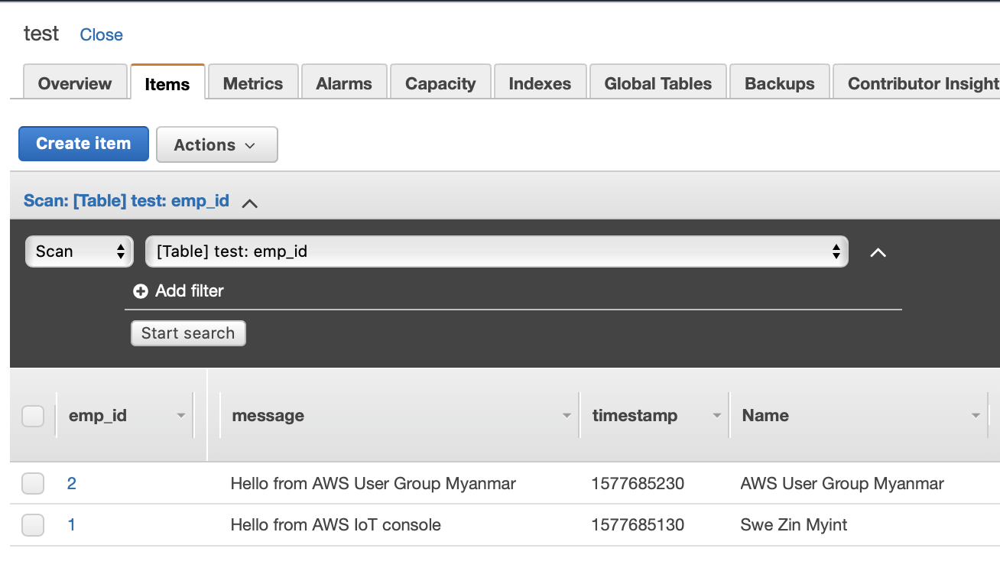

# IoT Rules Engine

ဒီနေ့ ခေတ်မှာ Smart City တွေ ဖြစ်လာတာနဲ့အမျှ Internet နဲ့ချိတ်ဆက်ထားတဲ့ Devices တွေ Things တွေကိုလည်း နေရာတိုင်းမှာတွေ့လာရပါတယ်။

ဒီနေ့မှာတော့ အဲ့လို Internetနဲ့ချိတ်ထားတဲ့ things တွေကို AWS ရဲ့ Internet of thingsအပိုင်းမှာပါတဲ့

 **AWS IoT Core** သုံးပီး ဘယ်လို Control လုပ်လို့ရနိုင်လဲ ဘယ်လို Actions တွေထည့်လို့ ရလဲဆိုတာ ကိုပြောပြပါရစေ။

AWS IoT ဘာကြောင့်သုံးလဲဆိုရင်


 IoT Core က ရလာတဲ့ Raw Datas တွေကို SQL Rule query statement တွေနဲ့ပြန်ပီး filter လုပ်လို့ရနိုင်ပါတယ်။



Real time တစ်ခါတည်း IoT Topic နောက်တစ်ခုကို တန်းပီး Republish လုပ်လို့ရနိုင်ပါတယ်။



 Raw data တွေ ဖြစ်တဲ့ Messages တွေကို AWS service သုံးပီး Data တွေ S3, DynamoDB ,etc တွေမှာ store လုပ်နိုင်ပါတယ်။



Store လုပ်ထားတဲ့ Data တွေကို  Kinesis Analytics တွေ QuickSight တို့လို Analytic tool တွေ တစ်ခါတည်း သုံးပီး Real time monitoring Dashboard ပါတစ်ခါတည်းလုပ်နိုင်တာကလည်း AWS IoT core ရဲ့ အားသာချက်တွေ ဖြစ်ပါတယ်။


> **SQL \(Rule Query Statement\) နဲ့ Filter လုပ်ထားတဲ့ Message တွေကို ကိုယ်ရဲ့ Application မှာ တကယ်လိုအပ်တဲ့ပုံစံကို AWS Service တွေဖြစ်တဲ့**

* S3
* DynamoDB
* Lambda Function
* SNS
* SQS
* Kinesis Stream
* Kinesis Firehose Stream
* IoT Topic
* CloudWatch
* Elastic Search
* Salesforce IoT Input Stream
* IoT Events input
* Step Function
* HTTPS

 Services တွေနဲ့ **real time** ချိတ်ဆက်ပီး ****အသုံးပြုလို့ရပါတယ်။  


## IoT \(Internet of Things\)


ပထမဦးစွာ IoT Devices တွေကို AWS IoT Core ရဲ့ Manage မှာ Things connect လုပ်ပီး အသုံးပြုလို့ရနိုင်ပါတယ်။ 

**ဒီ Article မှာတော့ Device မပါပဲ** _**MQTT Client ကို အသုံးပြုပီး Topic ကို Subscribe / Publish**_ **လုပ်သွားပါမယ်။**

\*\*\*\*

## **MQTT \(Message Queuing Telemetry Transport\)**

MQTT ဆိုတဲ့ Message Queuing Telemetry Transport ဆိုတဲ့ Protocol ကို တော့ IoT သုံးဖူးတဲ့သူတိုင်း သိကြမှာပါ။


MQTT ရဲ့ အလုပ်လုပ်ပုံကတော့ Publisher ဆိုတာ IoT devices တွေကနေ Real time messages တွေကို ပို့လိုက်ပီး Subscriber က လက်ခံသူတွေ ဖြစ်ပါတယ်။

အဲ့ဒီ MQTT ကရလာတဲ့ raw message ကို AWS IoT Coreသုံးပီး Rules engine မှာ SQL နဲ့ ဘယ်လို query လုပ်လို့ရနိုင်လဲဆိုတာ နားလည်သလောက်ပြန်ရှင်းပြပါရစေ။

## MQTT Client \(Test\)

**Subscribe**


ပုံမှာပြထားသလို AWS IoT Core အောက်မှာ Testလုပ်လို့ရနိုင်ပါတယ်။ 

အခု စမ်းပြထားတာကတော့ **MQTT client မှာ awsugmm/test** ဆိုတဲ့ topic ကို subscribe လုပ်ထားတာပါ။

Subscribe လုပ်ထားပီးရင် အောက်ကပုံလို မြင်ရမှာပါ။ 


**Publish**


အဲ့ဒီ JSON Formatနဲ့ပြထားတဲ့နေရာကနေ message တွေကို publish လုပ်ပြပါမယ်။ တကယ့် လက်တွေ့ IoT Device နဲ့စမ်းရင်တော့ အဲ့ IoT Device ကရလာတဲ့ Message ကို ဒီ MQTT Client  ကနေ real time data တွေကို မြင်ရမှာပါ။


အခုကတော့ 

#### Demo 

```text
{
  "message": "Hello from AWS IoT console",
  "emp_id": "1",
  "emp_name": "swezin",
  "timestamp":1577685130,
  "contact": 
  {
  "address": "Yangon",
  "phone": "098765432"
  }
}

{
  "message": "Hello from AWS User Group Myanmar",
  "emp_id": "2",
  "emp_name": "awsugmm",
  "timestamp":1577685230,
  "contact": 
  {
  "address": "Yangon",
  "phone": "09876556"
  }
}
```

JSON Format နဲ့ Data ကို အောက်ထဲကပုံကလို Publish လုပ်ပြထားပါတယ်။


## IoT Rules

Rules Engine / Rule actions လို့လည်း ခေါ်လို့ရပါတယ်။

ဘာ Rule မမှ ရှိသေးတဲ့ပုံပါ။


Rule တစ်ခု Create ဖို့ဆိုရင် Topic တစ်ခုလောက်ရှိထားသင့်ပါတယ်။ Test ကနေ topic ကို publish/shbscribe လုပ်ထားပီး စမ်းကြည့်လို့ရနိုင်ပါတယ်။


Name တွေ Description တွေက မိမိ ကြိုက်တာပေးလို့ရပါတယ်။ ဒီ Article ရဲ့ အဓိက ပြောပြချင်တဲ့အပိုင်းလေးကို ရောက်ပါပီ။ တစ်ခုကတော့ **Rule query statement** ပါ။


## Rule Query Statement

```sql
SELECT * FROM 'awsugmm/test'
```

က တော့ Topic ကရလာတဲ့ Data အကုန်လုံးကို ယူထားတာပါ။

**IoT Rule engine က JSON Data types အကုန်လုံးကို support လုပ်ပေးသလို Int/ Decimal ကနေ String , String ကနေ Decimal အကုန်ပြောင်းလို့ရပါတယ်။ နောက်အားသာချက်တွေက Functions တွေ Operators တွေ Literals တွေ Case statements တွေပါ supportပေးတော့ သုံးရတာ တော်တော် အဆင်ပြေပါတယ်။**

အသေးစိတ်ကိုတော့ ဒီ link \([https://docs.aws.amazon.com/iot/latest/developerguide/iot-sql-reference.html](https://docs.aws.amazon.com/iot/latest/developerguide/iot-sql-reference.html)\)ကနေ လေ့လာနိုင်ပါတယ်။

```sql
SELECT Clause
FROM Clause
WHERE Clause
```

အပေါ်က SQL Clause 3ခုကိုတော့ သိထားသင့်ပါတယ်။ Rule createလုပ်ပီးရင် တော့နည်းနည်း စမ်းပြပါမယ်။


## Rule Actions

အပေါ်က ပြောခဲ့တဲ့ AWS Serviceတွေကို action ကနေ သွားထည့်လို့ရပါတယ်။ Rule create လုပ်တဲ့အချိန်မှာ Add actions ကိုနှိပ်လိုက်ရင်  အောက်က ပုံကို တွေ့ရမှာပါ။


ဒီလို Actions တွေ ကို သုံးပီး မိမိတို့ရဲ့ IoT Devices ရဲ့ Data တွေကို Real time monitoring / Dashboard ပါတစ်ခါတည်းလုပ်နိုင်ပါတယ်။

အခုကတော့ DynamoDBနဲ့စမ်းပြပါမယ်။


Action တစ်ခုကို ရွေးပီးရင် မိမိသုံးမယ့် Action က ဒီ AWS IoT Core ကနေ လာတဲ့ Datas တွေကိုလက်ခံမယ့် Resourceရှိဖို့လိုပါတယ်။ မရှိသေးလို့ Createလုပ်လို့ရပါတယ်။ ဒီ Article မှတော့ test ဆိုတဲ့ DynamoDB tableနဲ့ နည်းနည်း စမ်းပြပါမယ်။


Action တစ်ခုကိုထည့်ပီးရင် အောက်ကပုံလို နောက် Action တွေပါထပ်ထည့်လို့ရပါတယ်။



Rule တစ်ခုမှာ Actions တွေကို ကိုယ့် Solutions မှာလိုအပ်သလို ကြည့်ပီးထည့်လို့ရတာက IoT Core ရဲ့ အားသာချက် နောက်တစ်ခုပါ။



Rule တစ်ခုမှာ error action ပါထည့်လို့ရပါတယ်။ Rule တစ်ခုကို Create လုပ်ပြရင် အောက်ကပုံလို မြင်ရမှာပါ။


Rule Create လုပ်ပီးရင် Test ကနေ Message တွေကို Publishလုပ်ပီး DynamoDB မှာဝင် Action အလုပ်လုပ် /မလုပ်ကို ဝင်ကြည့်လို့ရပါပီ။


Action လည်း အလုပ်လုပ်ပီဆိုတော့ SQL ရဲ့Case Statmentလေး စမ်းပြပါမယ်။

```sql
SELECT *, 
 CASE emp_name 
 WHEN 'swezin' THEN 'Swe Zin Myint'
 WHEN 'awsugmm' THEN 'AWS User Group Myanmar' 
 ELSE 'no name' END as Name 
 FROM 'awsugmm/test'
```

Demo စမ်းပြထားတဲ့  emp\_name ရဲ့ swezinတို့ awsugmmတို့ကို Full Nameပြောင်းပီး နောက် Column တစ်ခုကို Case statement နဲ့ create လုပ်ပီး Update လုပ်ပေးလိုက်ပါ။



Test Table မှာ Column တစ်ခု create လုပ်သွားပါတယ်။ ဒီနေရာမှာ ပြောချင်တာကတော့ IoT Devices ကပို့လိုက်တဲ့ Data တွေကို SQL Rule Query statement ကနေ တော်တော်များများကို filter လုပ်နိုင်ပါတယ်။

```sql
SELECT *,
topic(2) as level FROM 'awsugmm/+/test'
```

+ ကတော့ any one level ပါ။ awsugmmအောက်မှာ Devices ပေါင်းစုံရှိနေရင် အဲ့ Device အကုန်လုံးရဲ့ data တွေပါ ရနိုင်ပါတယ်။ topic\(2\) ကတော့ DynamoDB ထဲကို levelဆိုတဲ့ column အနေနဲ့ ဘယ် Deviceကလာတာကို သိမ်းထားနိုင်ပါတယ်။လေ့လာနေတဲ့သူတစ်ယောက်မို့ အမှားပါရင် ခွင့်လွှတ်ပေးကြပါ။ ဆက်လက်ကြိုးစားပါ့မယ်။ 

 I hope you found it useful and interesting .Thanks for taking the time.


