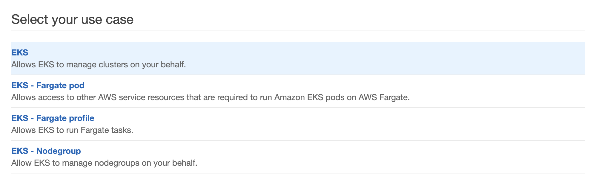
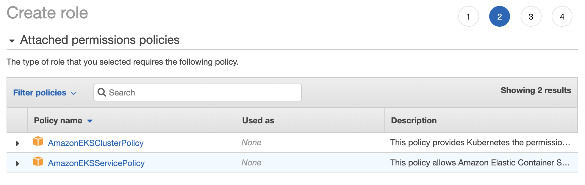
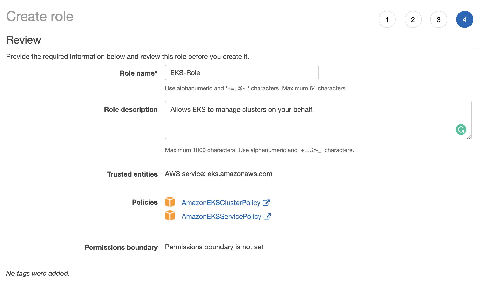
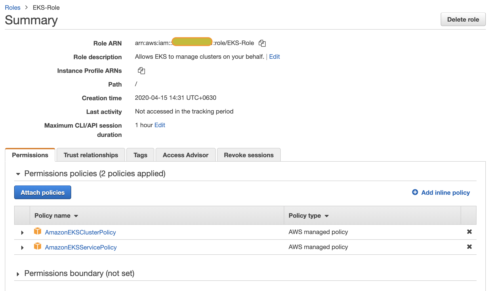
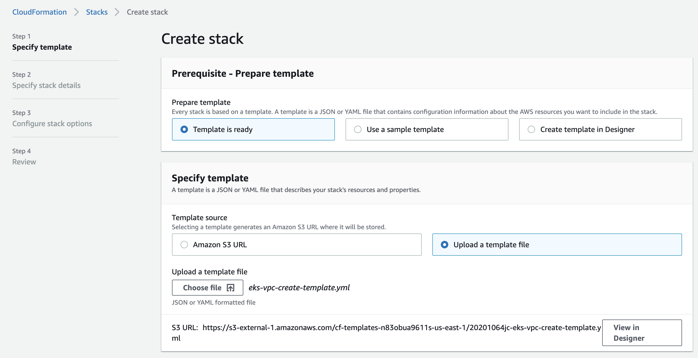
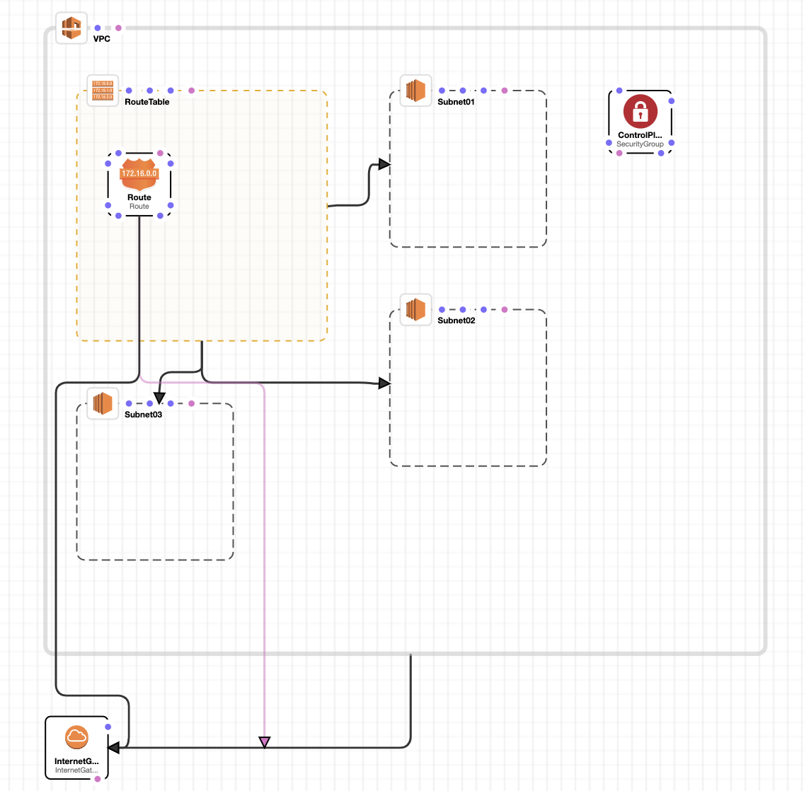
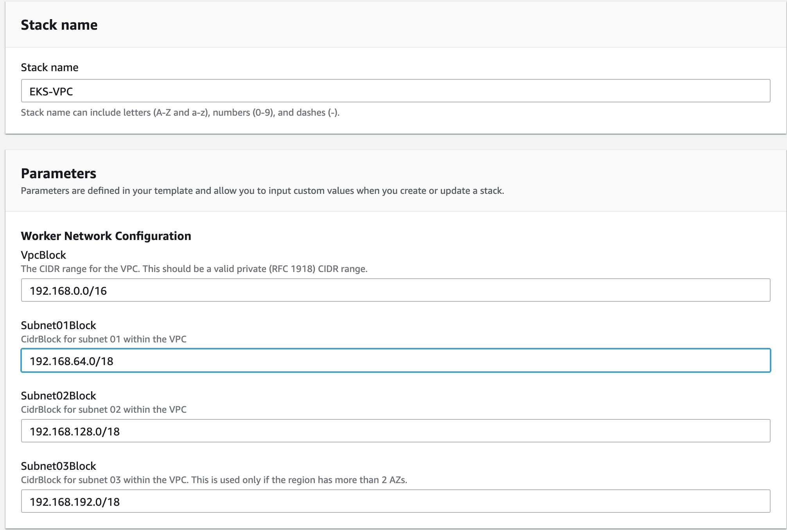

# Amazon EKS Cluster Provisioning

ပထမဦးစွာ ဒီ Blog tutorial က [AWS User Group Myanmar](https://www.facebook.com/groups/AWSusergroupmyanmar/) က ကျင်းပမဲ့ Online Meetup မှာ ကျွန်တော်ပြောသွားမဲ့ "**Amazon EKS - Kubernetes on AWS**" Topic လေးနဲ့တူတူ လေ့လာပြီး ကိုယ်ကိုတိုင် AWS EKS cluster ဆောက်ပြီးလိုက်စမ်းနိုင်အောင်ရည်ရွယ်ပြီးရေးထားချင်းဖြစ်ပါတယ်။   
ကျွန်တော်တို.ပွဲလေး ကိုတက်ရောက်ဖို.ဖိတ်ပါရစေ .. ပြီးတော့ Topic များကိုလည်းအောက်မှာဖော်ပြထားတဲ့ Topic Board မှာ ဝင်ရောက်ကြည့်နိုင်ပါတယ်။ 


[https://airtable.com/shrGToJczSuy1KZAr](https://airtable.com/shrGToJczSuy1KZAr)


အဲ နောက်တစ်ခုက Speaker အဖြစ်နဲ့ Sharing လုပ်ပေးချင်ရင်လည်း ကျွန်တော်တို.က ဝမ်းမြောက်ဝမ်းသာ ဖိတ်ကြားပါရစေ။ အောက်က လင့် လေးကနေ စာရင်းသွင်းလိုရပါတယ်ဗျ။


[https://airtable.com/shrV1vefDtNLcAaZ0](https://airtable.com/shrV1vefDtNLcAaZ0)


ပွဲအကြောင်းပြောပြီးပြီဆိုတော့ရေးမည့်ဟာလေးကိုဆက်ပါရစေ။ 

Amazon EKS အကြောင်းမပြောခင် ကနဦးအနေနဲ့ Kubernetes ဆိုတာဘာလဲ ဘယ်လို လဲ သူ.ရဲ့ architecture က ဘယ်လိုအလုပ်တွေလုပ်လဲနည်းနည်းအကျဉ်းချုံးကြည့်ရအောင်။ Kubernetes ရဲ့ official documentation မှာတော့အောက်ကအတိုင်းဖော်ပြထားပါတယ်။ အဓိက ကတော့ မြန်မာလိုပြောရရင်တော့ Kubernetes က containerized application တွေကို လွယ်လွယ်ကူကူ စီမံခံခွဲနိုင်အောင်၊ မောင်းနှင်းနိုင်အောင် ပြုလုပ်ထားတဲ့ solution တစ်ခုဖြစ်တယ်ပေါ့။ 


Kubernetes is a portable, extensible, open-source platform for managing containerized workloads and services, that facilitates both declarative configuration and automation. It has a large, rapidly growing ecosystem. Kubernetes services, support, and tools are widely available.


ဆိုတော့ Kubernetes Cluster ရဲ့ architecture, components တွေကိုလေ့လာကြည့်ရအောင်။Master \(Control Plane\) မှာဘာတွေပါလဲ၊ Worker node \(Minion\) မှာဘာတွေပါဝင်လဲ လေ့လာကြည့်ရအောင်။ ကျွန်တော်ဒီ Blog Post က Amazon EKS cluster provisioning ဆိုတော့ Kubernetes cluster architecture ကိုတော့ မရေးတော့ဘူး ဒါပေမဲ့ မြန်မာလိုပဲရေးထားပြီးနားလည်ရလွယ်ကူတဲ့ Blog content လေးကိုအောက်မှာ link အနေနဲ့ ညွန်းလိုက်ပါတယ်။   


[https://blog.k8smm.org/k8s-cluster-achitecture](https://blog.k8smm.org/k8s-cluster-achitecture)


Amazon EKS က Amazon Web Services ရဲ. Managed Kubernetes Service တစ်ခုဖြစ်ပါသည်။ အဓိက အားဖြင့် Kubernetes ရဲ့ master control plane ကို AWS ဘက်က managed လုပ်ပေးချင်းကို ဆိုလိုတာပါ။ အဲ့ထက်ပိုပြီး EKS က data plane ဖြစ်တဲ့ worker nodes များပါ managed လုပ်ပေးနိုင်ပြီ ဟုလည်း  AWS က  [announced](https://aws.amazon.com/blogs/containers/eks-managed-node-groups/) လုပ်ထားပါတယ်။ 

အိုကေ .. ဒါဆို လက်တွေ EKS Cluster ကို ဆောက်ကြည့်ကြရအောင်။အရင်ဆုံး EKS Cluster မဆောက်ခင် Official Documentation ကို Share ပါရစေ။  


[https://docs.aws.amazon.com/eks/latest/userguide/what-is-eks.html](https://docs.aws.amazon.com/eks/latest/userguide/what-is-eks.html)


CloudFormation Template တွေကိုလည်းတနေရာထဲက Download ချင်ရင်လည်းအဆင်ပြေဖို.တွက်ပြန် Share ပေးထားပါတယ်။  


[https://github.com/phyominhtun1990/AWS-EKS-Cluster-Introduction](https://github.com/phyominhtun1990/AWS-EKS-Cluster-Introduction.git)


ဆိုတော့ကျွန်တော်တို. EKS Cluster စဆောက်ကြရအောင်။ပထမဆုံးအနေနဲ့ cluster provision မလုပ်ခင် EKS တွက် IAM Role ကို စဆောက်ရပါမယ်။  AWS IAM Console ကို သွားပြီးအောက်မှာဖော်ပြထားတဲ့အတိုင်း IAM Role တစ်ခုကို တည်ဆောက်ပါမယ်။ 

EKS IAM Role ဆောက်ပြီးပြီ ဆိုတော့ နောက်တစ်ဆင့်အနေနဲ့ EKS Cluster အတွက် VPC ဆောက်ပြီး Networking setting ချပေးရပါမယ်။ VPC ဆောက်ရာတွင် manual ဆောက်တာထက် CloudFormation နဲ့တည်ဆောက်ပါမယ်။ EKS VPC တည်ဆောက်တဲ့ CloudFormation Template ကိုအောက်ကလင့်မှာ Clone or Download လုပ်လို.ရပါတယ်။ \(**Official Link ကနေလဲ Download လုပ်လို.ရပါတယ်**\)။ 


[https://github.com/phyominhtun1990/AWS-EKS-Cluster-Introduction.git](https://github.com/phyominhtun1990/AWS-EKS-Cluster-Introduction.git)


Download လုပ်ပြီးပြီဆိုရင်ကျွန်တော်တို. တွေ CloudFormation Console ကိုသွားပါမယ်။ပြီးနောက် VPC Create template yml file ကို အောက်ဖော်ပြပါအတိုင်း upload template နေရာမှာ upload တင်ပါမယ်။  

VPC မဆောက်ခင် တစ်ချက်ကြည့်ကြည့် ရင် VPC က Subnet သုံးခု အကြမ်းဖျဉ်းပါပါတယ်။ ထိုနောက်အောက်ဖော်ပြပါအတိုင်းဆက်လက်တည်ဆောက်ပါမယ်။ကျွန်တော်ကတော့ Template ထဲကအတိုင်း default ထားလိုက်ပြီးတည်ဆောက်ပါမယ်။ 

