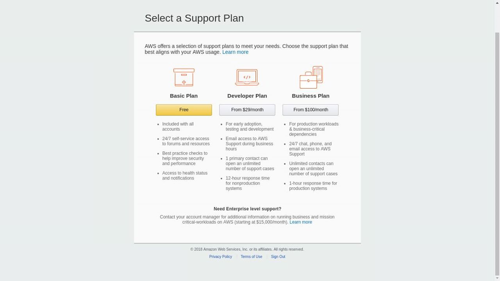
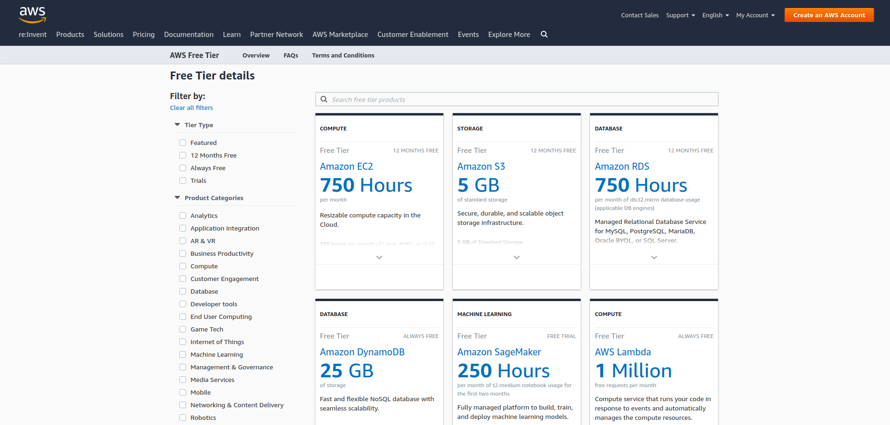

# Gain free, hands-on experience with the AWS platform, products, and services

ဒီတစ်ခေါက်မှာတော့ Amazon Web Services ရဲ့ Free Tier အကောင့်ကိုဘယ်လိုဖွင့်ရမလဲ၊ Free Tier မှာဘယ်လိုမျိုး Services, Platforms, Products တွေအသုံးချလို့ရလဲ၊ အချိန်အတိုင်းအတာဘယ်လောက်ထိသုံးနိုင်မှာလဲ၊ Free Tier အကောင့်ကို အသုံးပြုပြီး ဘယ်လိုအကျိုးရှိရှိအသုံးချမယ်ဆိုတဲ့ အချက်လေးတွေကို Step-by-step အဆင့်လေးတွေကိုပြောပြပေးသွားမှာဖြစ်ပါတယ်။ လက်ရှိမှာတော့ Cloud Service Provider တွေတော်တော်များများက User တွေအနေနဲ့ အစမ်းအသုံးပြုနိုင်အောင် Credit/Debit Card ရှိရုံနဲ့ သက်ဆိုင်ရာ Cloud Service Provider တွေဆီမှာ Free Tier, $100/200 Credit ဒေါ်လာဘယ်လောက်ဖိုးသုံးစွဲခွင့်ဘာညာ အစရှိသဖြင့်ပေးထားကြပါတယ်။ ကိုယ်ပိုင် အကောင့်ရှိရုံနဲ့ အတိုင်းအတာတစ်ခုထိ Cloud Service တွေရဲ့ Hands-on lab အသုံးပြုခွင့်ရမှာဆိုတော့ Learning လုပ်ရတာပိုမိုလွယ်ကူသွားလိမ့်မယ်လို့လည်းဆိုနိုင်ပါတယ်။ ဒီတော့ စလိုက်ကြရအောင်ဗျာ၊ အရင်ဆုံးအနေနဲ့ AWS Free Tier Account ဖွင့်ဖို့ရာ Visa/Master ကဒ်လိုပါတယ်။ Visa/Master တစ်ခုခုရှိပြီးသားသူတွေအနေနဲ့ကတော့ ကဒ်ထဲမှာငွေလက်ကျန်အနည်းငယ်ရှိမယ်ဆိုရင်တော့ အဆင်ပြေပါပြီ။ Visa/Master မရှိသေးတဲ့သူတွေအတွက်ကတော့ မိမိကြိုက်နှစ်သက်ရာနီးစပ်ရာ ဘဏ်မှာ Visa/Master-Credit/Debit ဖြစ်ဖြစ်ကြိုက်နှစ်သက်ရာကဒ်တစ်ခုခုကို အရင်ဦးစွာသွားလုပ်လိုက်ပါ။ ကဒ်လုပ်ခ မြန်မာငွေ တစ်သောင်းဝန်းကျင်နဲ့ စစချင်းမှာ ကဒ်ထဲကိုတော့ USD $50 သွင်းရပါတယ်။ ဒီနေ့လုပ်ရင်ဒီနေ့ရပါတယ် \( ကြေညာမဟုတ်ပါ :D \) မနက်ပိုင်းလောက်ကဒ်လုပ်ရင် ညနေပိုင်းလောက်ဆိုရင် ကဒ်ကိုအသုံးပြုလို့ရပါပြီ။ Free Tier Account ဖွင့်ဖို့လည်း Ready ဖြစ်ပြီဆိုရင် [**GET AWS FREE TIRE**](https://aws.amazon.com/free) ကိုဝင်လိုက်ပါ။

## Step-1 Create an AWS Account

Email Address, Username, Password ဘာညာထည့်ပြီး Continue ကိုနှိပ်ပါ။

## Step-2 Contact Information

ဒုတိယအဆင့်နေနဲ့ ကိုယ့်ရဲ့ Contact Information ကိုထည့်ပေးရပါမယ်။ ဒီနေရာမှာတစ်ချက်ရှင်းပြပါရစေ။ Contact Information ဖြည့်ခိုင်းတဲ့နေရာ အရင်ဆုံး _Account Type_ ကိုရွေးပေးရပါမယ်။ Professional & Personal ဆိုပြီး ၂ ခုရှိပါတယ်။ Professional Account Type ကတော့ မိမိအနေနဲ့ AWS ရဲ့ Service တွေကို Individual Company အနေနဲ့ အသုံးပြုမယ်ဆိုရင်တော့ Professional Account Type ကိုရွေးချယ်သင့်ပါတယ်။ ဒီလိုမှမဟုတ်ဘူး SystemAdmins/Developers/EndUsers တွေက မိမိအနေနဲ့ တစ်ကိုယ်ရည်တစ်ကာယသော်လည်းကောင်း၊ မိမိ Project အတွက်သော်လည်းကောင်း အသုံးပြုမယ်ဆိုရင်တော့ Personal Account Type ကိုရွေးချယ်သင့်ပါတယ်။ ဒီ Account Type ၂ ခုက Functionality အရ ထွေထွေထူးထူးကွာခြားချက်ရယ်လို့မရှိပါဘူး။ Professional Account Type ကိုရွေးမယ်ဆိုရင်တော့ ကိုယ်ရဲ့ Company Name ထည့်ခိုင်းပါမယ်။ Personal Account Type ရွေးချယ်မယ်ဆိုရင်တော့ Company Name ထည့်စရာမလိုပါဘူး။ Contact Information ကိုပြည့်စုံအောင်ဖြည့်ပြီးပြီဆိုရင်တော့ Customer Agreement ကို Mark လုပ်ပြီး နောက်တစ်ဆင့်ကို ဆက်လက်လုပ်ဆောင်ပါမယ်။

## Step-3  Payment Information

တတိယအဆင့် ကတော့ AWS အနေနဲ့ Free Tier Usage အတွက် မိမိဆီက Payment Information ကိုတောင်းပါလိမ့်မယ်။ ကျွန်တော်တို့ စစချင်းမှာပြောခဲ့သလိုပဲ Credit/Debit card number တစ်ခုခုနဲ့ Link လုပ်ပေးရပါမယ်။ ကဒ်မှာပါတဲ့ Information လေးတွေကို သေချာဂရုတစိုက်ဖြည့်သွင်းပါ။ နောက်ပြီးရင်တော့ Billing Address မှန်၊ မမှန်ပြန်စစ်ပြီး Secure Summit ကိုနှိပ်လိုက်ရင်အဆင်ပြေပါပြီ။

## Step-4 Confirm you Identity

ဒီအဆင့်မှာတော့ မိမိ Account Confirmation အတွက် Active \( လက်ရှိအသုံးပြုနေတဲ့ \) ဖုန်းနံပါတ်တစ်လုံးကိုထည့်ပေးရပါမယ်။ AWS အနေနဲ့ Direct Phone Call မှတစ်ဆင့် 4-Digit Code တစ်ခု ကိုပြောပြီး Account ဖွင့်သူအနေနဲ့ Direct Phone Call မှတစ်ဆင့်ပြောသော 4-Digit Code ကိုပြန်လည်ထည့်သွင်းပေးရမှာဖြစ်ပါတယ်။ 4-Digit Code ကိုမှန်ကန်အောင်ဖြည့်ပြီးပြီဆိုရင်တော့ Your account has been verified successfully ဆိုပြီးပေါ်မှာလာမှာ။ ထို့နောက် Continue ကို နှိပ်ကာ **Final Step** ကိုရောက်ပါမယ်။

## Step-5 Final Step

Final Step မှာတော့ ကျွန်တော်တို့အနေနဲ့ မိမိတို့အကောင့်ကိုဘယ်လို Support Plan တွေနဲ့သုံးမလဲဆိုတာကိုရွေးလို့ရပါမယ်။ အခု အကောင့်က Company အတွက်သုံးတာမျိုးမဟုတ်ဘူး AWS ရဲ့ Support တွေဘာမှမလိုဘူးဆိုရင်တော့ Basic Plan လောက်နဲ့တင်အဆင်ပြေပါတယ်။ ဒီလိုမှမဟုတ်ဘူး ကိုယ့်အနေနဲ့ တစ်ခုခုဖြစ်ရင် AWS ရဲ့ Support တွေကိုမြန်မြန်ဆန်ဆန်လိုအပ်တယ်ဆိုရင်တော့ Developer Plan နဲ့ Business Plan ကိုရွေးချယ်လို့ရပါတယ်။ AWS ရဲ့ Support Plan ကွာခြားချက်တွေကတော့ အောက်ကပုံမှာကြည့်နိုင်ပါတယ်။

Support Plan ကိုရွေးချယ်ပြီးရင်တော့ ~ Tada ~ AWS Web Management Console ကနေ မိမိကြိုက်နှစ်သက်ရာ Services တွေကို စတင်စမ်းသပ် အသုံးပြုနိုင်ပါပြီခင်ဗျာ။ 

မှတ်ချက်အနေနဲ့ကတော့ AWS က Free Tier ကို အကောင့်စဖွင့်တဲ့နေ့မှစပြီး ၁၂ လ \( ၁နှစ် \) တိတိ Limited Resource တွေကိုအသုံးပြုခွင့်ရပါမယ်။ Free Tier မှာ ဘယ်လောက်အတိုင်းအတာထိအသုံးပြုလို့ရမယ်ဆိုတာကို ဒီလင့်ခ် မှာကြည့်နိုင်ပါတယ်။ Limited ဆိုပေမယ့် အတော်လေးကိုအဆင်ပြေပါတယ်။ ဥပမာဆိုရင် ကျွန်တော်တို့ အသုံးများကြတဲ့ Elastic Compute Cloud \( EC2 \) Instance တစ်လုံးကို တစ်လမှာ နာရီ ၇၅၀ သုံးဆွဲခွင့်ပြုထားပါတယ်။ နာရီ ၇၅၀ ဆိုတဲ့ အချိန်က ရက်ပေါင်း ၃၁ ရက် ရှိမဲ့လ တွေမှာဆိုရင်တောင်မှ ကောင်းကောင်းကြီး Run ဖို့လုံလောက်တဲ့ အချိန်ပမာဏဖြစ်ပါတယ်။ အကောင့်ဖွင့်ထားပြီး ၁၂ ကျော်တဲ့ အကောင့်တွေကတော့ Free Tier အသုံးခွင့်ရှိတော့မှာမဟုတ်ပါဘူး။

ဟုတ်ကဲ့။ အခုလောက်ဆိုရင်တော့ AWS Free Tier Account ကို အလွယ်တကူဖွင့်လို့ရမယ်လို့ယုံကြည်ပါတယ် ခင်ဗျာ။ နောက်လာမည့် အပတ်မှာတော့ Things to do after registering AWS free tier account ဆိုတဲ့ ဆောင်ရန်ရှောင်ရန်လေးများအကြောင်းကို ဆက်လက်ရေးသွားဦးမှာမို့ အားပေးကြပါဦးခင်ဗျာ။ ဆက်လက်ကြိုးစားပါဦးမည်

[**AWS User Group Myanmar**](https://www.facebook.com/groups/AWSusergroupmyanmar)

