# Managing private EC2 instance with Bastion Host

ကျွန်တော်တို. AWS မှာ Infrastructure စဆောက်ရင် VPC ဆောက်ကြပီးတော့ public subnet တွေ private subnet တွေ စခွဲကြပါတယ်။ပြီးတော့ route table နဲ့ route တွေခွဲ ပြီးတော့ NAT gateway or NAT instance setup လုပ်ကြနဲ့စတင်လုပ်ကြရပါတယ်။ အဲ့မှာ ကျွန်တော်ဆို public subnet မှာ ဆို loadbalancer , NAT gateway or instance ထားပြီး  တကယ် run နေတဲ့ instance တွေ DB တွေဆိုတတ်နိုင်သလောက်  private subnet မှာ ထားပါတယ်။Security အရဆိုလည်း ကောင်းတာပေါ့။  
ဥပမာ Web Server တစ်လုံးကို VPC Private Subnet မှာထားပြီး ALB or Classic Load Balancer  public subnet မှာထားပြီး run ဖြစ်ပါတယ်။ ဒါဆို user တွေက loadbalancer endpoint \(or\) AWS Route 53 DNS name နဲ့ လှမ်း Access  လုပ်လို.ရပါတယ်။နောက်ပြီး public subnet မှာရှိတဲ့ instance တွေဆို SSH or RDP နဲ့လှမ်း access လုပ်ဖို.အဆင်ပြေပေမဲ့ private subnet မှာရှိတဲ့ instance တွေဆို လှမ်း access လုပ်ဖို.နည်းနည်းအခက်အခဲ ရှိလာပါတယ်။   
ဒါဆို ဘယ်လိုအခြေနေမှာ Bastion Host လိုမလဲပေါ့ ။   
အဲ့တာလေးမပြောခင် **Bastion Host** ဘာလဲဆိုတော့ `Public Subnet မှာ ရှိတဲ့ EC2 instance ပါပဲ` သူကဘာလုပ်ပေးလဲဆိုတော့ AWS VPC private subnet မှာရှိနေတဲ့ ကိုယ့်ရဲ့ အရေးကြီး server တွေကို SSH or RDP လှမ်းဝင်ပြီး manage လုပ်ဖို.ပါပဲ။ သာမန်အားဖြင့် private subnet က instance တွေက public ip မရှိပါဘူး ထို.ကြောင့် သူတို.ကို ကျွန်တော် တို. laptop ကနေ လှမ်း manage လုပ်ဖို. bastion host ကနေတဆင့်မှ ဝင်ရောက်ပြုလုပ်ရပါတယ်။ 

Bastion Host ဆိုတာ AWS ရဲ့ service တစ်ခုလားလို.မေးလာရင် မဟုတ်ပါဘူး အမှန်က သူသည် အဓိကအားဖြင့် linux ဆို  linux တစ်လုံးတာဖြစ်ပြီး SSH protocol ကို သုံးပြီး jump လုပ်ကာနောက်တစ်လုံးကို Login ဝင်ပြီး manage လုပ်တာပါ။Windows ဆိုလည်း ထိုနည်းအတူပဲ RDP နဲ့ jump လုပ်ကာ နောက်တစ်လုံးကို manage လုပ်တာပါပဲ။ ကျွန်တော်က ဒီ tutorial လေးမှာတော့ Linux instance တွေနဲ့လုပ်ပြမှာပါ။  
ဒီနေရာမှာ မေးစရာရှိတာက ကျွန်တော် AWS သုံးတာ bastion host မသုံးပဲ private subnet က instance ကိုဝင်မရဘူးလား? ဒီလိုဆိုရင်တော့ ကျွန်တော်ရေးထားတဲ့ ဒီ [**`tutorial`**](https://blog.awsugmm.org/tutorials/using-aws-systems-manager-to-login-ec2-instance-without-ssh) လေးနဲ့လည်း အသုံးပြုနိုင်ပါတယ်။တခြားသော cloud provider တွေမှာလည်းဆိုင်ရာဆိုင်ရာတွေရှိနေမှာပါ။ 

ဒါဆို bastion host နဲ့ private subnet က ec2 instance တစ်လုံးကိုဘယ်လိုဝင်ပြီး manage လုပ်မလဲဆိုတာကြည့်ကြည့်ရအောင်။အောက်ကပုံလေးကနေ bastion host ရဲ့ overview diagram ကိုလေ့လာနိုင်ပါတယ်။ 

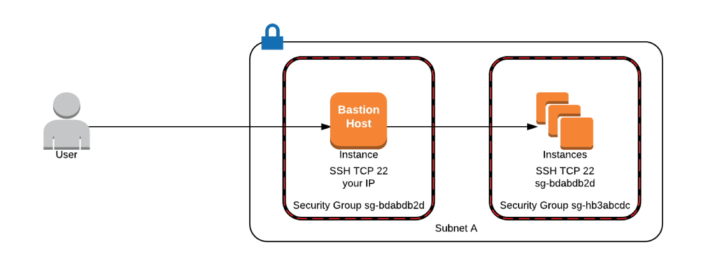

ပုံမှာပြထားတဲ့အတင်းဆိုရင် bastion host ကို public subnet မှာထားပြီး user က private subnet က instance ကိုလှမ်း remote login ဝင်တာပါ။အဲ့ဒီမှာ ကျွန်တော်ပြောမှာက AWS မှာဆိုတော့ security group ကိုနည်းနည်း configure လုပ်ပေးရပါတယ်။အထူးသဖြင့် security တွက် ဆို ကျွန်တော် public subnet က  bastion instance ရဲ့ security group မှာ ကျွန်တော်လက်ရှိ public ip range ကိုပဲ SSH Allow လုပ်ပါမယ် ပြီးနောက် private subnet က instance ရဲ့ security group မှာကတော့ bastion host ရဲ့ security group ကိုပဲ SSH Allow ပေးမှာပါ။Security အရဆိုရင်တော့ private subnet မှာရှိတဲ့ instance ကို bastion host ကနေပဲ access လုပ်လို.ရမှာပါ။


ဒါဆိုကျွန်တော်တို. AWS management console ကို login ဝင်ပြီး  Ec2 တစ်လုံးကို private subnet မှာ ဆောက်လိုက်ပါမယ်။ amazon linux 2 နဲ့ပါ။ 


ယခုပြထားသော public domain များ ip များသည် Demonstration ပြရန်သာ ရည်ရွယ်ပါသည်။ 


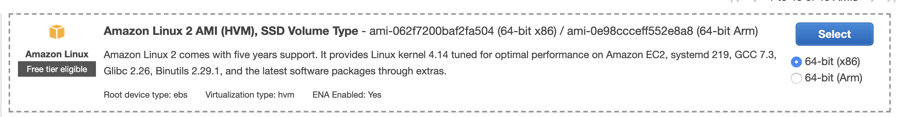

ထိုနောက်ကျွန်တော်တို. private instance ရဲ့ security group မှာ ssh allow ကို bastion host ရဲ့ security group id ကိုပဲပေးထားပါမယ်။ဆိုလိုတာက ssh ကို bastion host ကနေပဲ access လုပ်လို.ရမှာပါ။

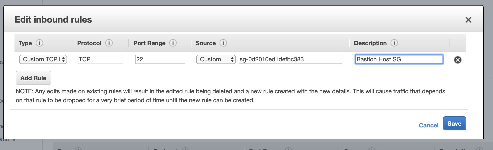

အားလုံး steps တွေပြီးသွားရင် pem key တစ်ခု create ပြီး instance ကို စတင် run လို.ရပါပြီ။ 

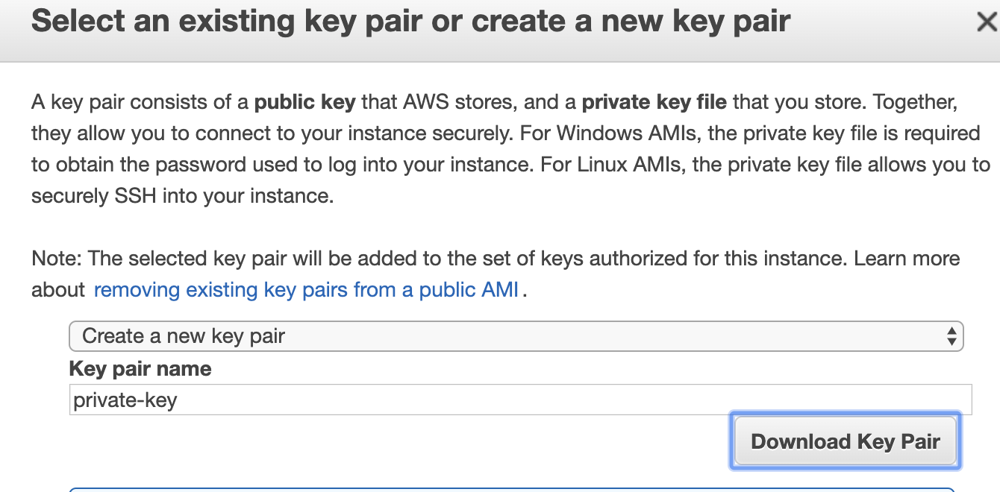

Pem Key Download ပြီးသွားတာနဲ့ Ec2 instance က private subnet မှာ running ဖြစ်နေတာကို မြင်တွေ.ရပါလိမ့်မယ်။ 

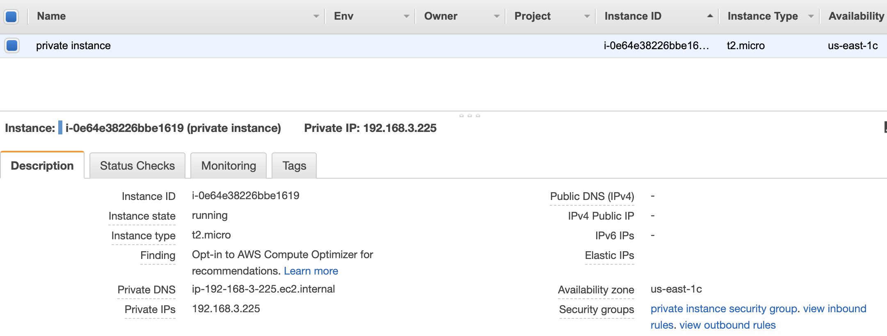

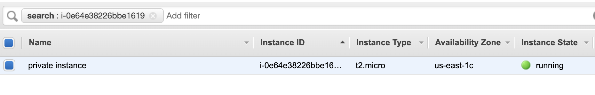

ထိုနောက်ကျွန်တော်တို. bastion host ကို public subnet မှာဆောက်ပါမယ်။ amazon linux 2 နဲ့ပါပဲ။ 

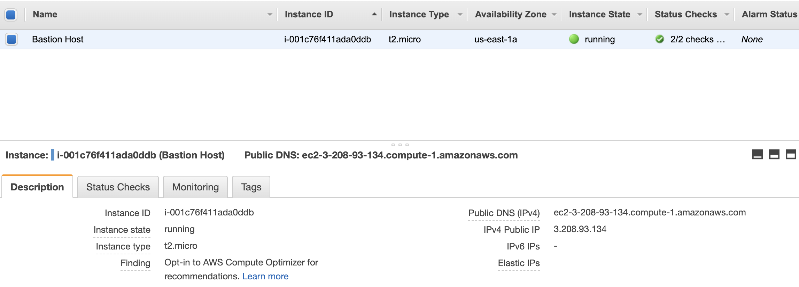

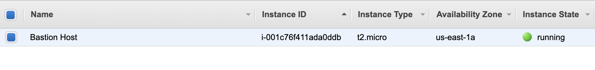

ပြီးရင် private instance လိုပဲ security group မှာပြင်ပါမယ်။ Bastion host ရဲ့ security group မှာ ကျွန်တော် laptop ရဲ့ public ip ကိုပဲ specific allow ပေးပါမယ်။Bastion host ကို ကျွန်တော်တစ်ယောက်တည်းကပဲ ssh access ရအောင်လို.ပါ။ 

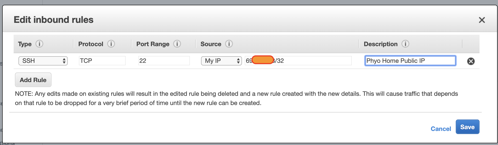

ထုံးစံအတိုင်းနောက်ဆုံးမှာ pem key ကို download ချပါမယ်။ 

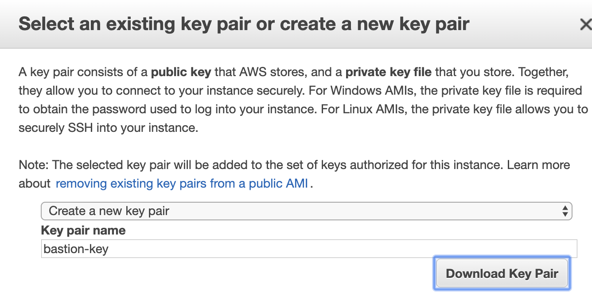

နောက်ဆုံး အောက်ကပုံမှာပြထားတဲ့အတိုင်း Ec2 နှစ်လုံး running ဖြစ်နေပါလိမ့်မယ်။တစ်ခုက public subnet နောက်တစ်ခုက private subnet မှာ run နေပါလိမ့်မယ်။  

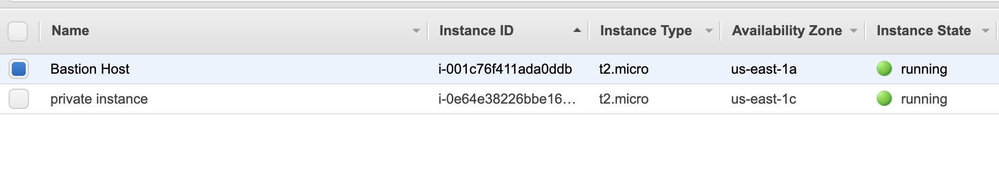

အားလုံး ဆောက်ပြီးပါက ကျွန်တော်တို.စပြီး bastion host ကနေတဆင့် private subnet က instance ကို login ဝင်ကြည့်ရအောင်။ မဝင်ခင်ကျွန်တော်တို. ip တွေ ssh username တွေတစ်ချက်ကြည့်ကြည့်ရအောင်။ 


Bastion Host Public URL = ec2-3-208-93-134.compute-1.amazonaws.com  
Private Instance IP = 192.168.3.225 



ယခုပြထားသော public domain များ ip များသည် Demonstration ပြရန်သက်သက်သာရည်ရွယ်ပါသည်။ 


အိုကေ ဒါဆို ကျွန်တော်တို. local linux terminal ကနေ ssh proxy command လေးရိုက်ပြီး private instance ကိုလှမ်းဝင်ကြည့်ရအောင်။ 

```text
$ ssh -i private-key.pem ec2-user@192.168.3.225 -o ProxyCommand="ssh -W %h:%p -i bastion-key.pem ec2-user@ec2-3-208-93-134.compute-1.amazonaws.com"
```

အထက်ပါ command လေးနဲ့ local ကနေ AWS private subnet မှာ ရှိတဲ့ instance လေးကို တိုက်ရိုက်တန်းဝင်လိုက်ပါတယ်။ 

```text
$ ssh -i private-key.pem ec2-user@192.168.3.225 -o ProxyCommand="ssh -W %h:%p -i bastion-key.pem ec2-user@ec2-3-208-93-134.compute-1.amazonaws.com" 
Last login: Thu Jan  9 17:49:38 2020 from ip-192-168-1-248.ec2.internal

       __|  __|_  )
       _|  (     /   Amazon Linux 2 AMI
      ___|\___|___|

https://aws.amazon.com/amazon-linux-2/
[ec2-user@ip-192-168-3-225 ~]$ ip a | grep eth0 
2: eth0: <BROADCAST,MULTICAST,UP,LOWER_UP> mtu 9001 qdisc pfifo_fast state UP group default qlen 1000
    inet 192.168.3.225/24 brd 192.168.3.255 scope global dynamic eth0
[ec2-user@ip-192-168-3-225 ~]$ 

```

ဒါဆိုကျွန်တော်တို. private instance ကိုဝင်သွားပါပြီ။ ဆိုတော့နောက်ဆုံး အနေနဲ့ ကျွန်တော်တို.အဲ့လို command အရှည်ကြီးကို မရိုက်ချင် မမှတ်ချင်ပါဘူး။ ဒါကြောင့်ကျွန်တော်တို. ssh config လေးရေးပြီးအလွယ်တကူဝင်ရောက်ကြည့်ပါမယ်။ဒါဆိုကျနော်တို. ssh config လေးကို **~/.ssh** ဆိုတဲ့ folder လေးမှာ **config** ဆိုပြီး ဆောက်ပြီး အောက်ပါအတိုင်း ဖြည့်လိုက်ပါမယ်။ 

```text
$ vim ~/.ssh/config
```

```text
Host private-instance 
  Hostname 192.168.3.225
  IdentityFile  /Users/phyominhtun/Desktop/private-key.pem  
  ForwardAgent yes
  User ec2-user
  ProxyCommand ssh -W %h:%p -i /Users/phyominhtun/Desktop/bastion-key.pem ec2-user@ec2-3-208-93-134.compute-1.amazonaws.com
```


ယခုပြထားသော public domain များ ip များသည် Demonstration ပြရန်သက်သက်သာရည်ရွယ်ပါသည်။ 


ဒါဆို file လည်းဆောက်ပြီးပီ config လေးလည်းဖြည့်ပြီးပြီဆိုပါက ကျွန်တော်တို. terminal ကနေအောက်ပါ command လေးရိုက်ပြီး private instance ကိုတိုက်ရိုက် login လုပ်လိုရပါပြီ။  

```text
$ ssh private-instance 
Last login: Thu Jan  9 17:56:04 2020 from ip-192-168-1-248.ec2.internal

       __|  __|_  )
       _|  (     /   Amazon Linux 2 AMI
      ___|\___|___|

https://aws.amazon.com/amazon-linux-2/
[ec2-user@ip-192-168-3-225 ~]$ 

```

ကျွန်တော်တို. local laptop ကနေ AWS private subnet က instance ကို bastion host ကနေတဆင့်တိုက်ရိုက်ဝင်ပြီး manage လုပ်လို.ရပါပြီ။    
နောက်ဆုံးအနေနဲ့ သိရှိရမည့်တစ်ချက်က bastion host က ကိုယ့် cloud network ကို အပြင်ကဝင်ပြီး private subnet က instance တွေက်ို manage လုပ်ဖို.အတွက်တာရည်ရွယ်ပြီး private subnet က instance တွေ internet စီပြန်လည်ထွက်ရှိဖို.ကတော့ AWS မှာ NAT gateway or Nat instance ဆိုတာကို public subnet မှာထားပေးဖို.လိုပါတယ်။   
ဆိုတော့ ကျွန်တော် NAT gateway and NAT instance ဆိုတာလေးကို နောက်ပိုင်း content များတွင်ဖော်ပြပေးသွားမည်ဟုပြောကြားရင်း ဒီစာစုလေးကို အဆုံးသတ်ပါရစေ။ 

အားလုံးကိုကျေးဇူးတင်ပါသည်။   
AWS User Group Myanmar  

